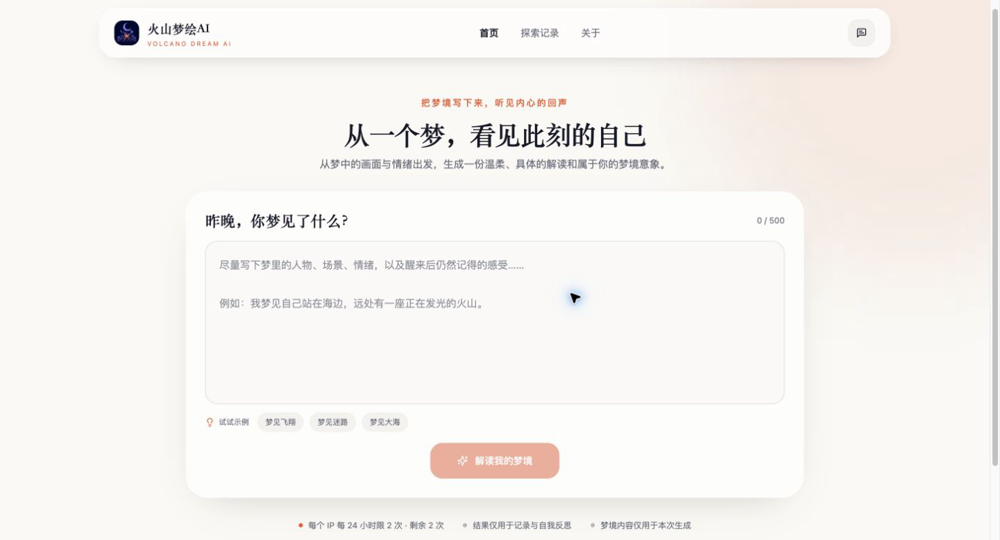
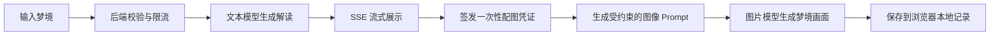

<div align="center">
  
  <h1>火山梦绘 AI</h1>
  <p>从一个梦，看见此刻的自己。</p>
  <p>
    <a href="https://www.volcanodream.online/"><strong>在线体验</strong></a>
    ·
    <a href="https://github.com/walkyufeng-hue/Volcano-Dream">GitHub 仓库</a>
  </p>
</div>

火山梦绘 AI（Volcano Dream AI）是一款 AI 梦境解读与视觉生成产品。用户写下梦境后，系统会结合中国传统梦文化与现代心理视角，流式生成结构化解读，并为梦境创作一张专属配图。

> 解梦结果仅用于娱乐和自我反思，不构成对未来的确定预测，也不能替代医学、心理或其他专业建议。

## 在线体验

访问：[https://www.volcanodream.online/](https://www.volcanodream.online/)



## 核心体验

- **结构化梦境解读**：呈现精华、摘要、核心情绪、梦境状态、关键符号、心理视角、文化象征与反思问题。
- **流式生成**：通过 SSE 实时返回内容，减少等待过程中的空白感，并支持主动停止生成。
- **梦境视觉化**：文字解读完成后签发一次性配图凭证，再调用图像模型生成 16:9 梦境画面。
- **本地梦境档案**：浏览器保存最近 10 条结构化梦境记录；生成图片使用 IndexedDB 存储，避免占满 LocalStorage。
- **便捷使用**：支持刷新保留草稿、复制解读、下载配图、防重复提交和响应式布局。
- **用量与成本保护**：默认不限制个人/IP 解梦次数，同时保留全站文字与图片预算总闸门。
- **反馈与可选登录**：内置意见反馈；配置 GitHub OAuth 后可启用登录能力。

## 产品流程



这是一条确定性的 AI Workflow：模型负责文本理解、内容生成和视觉创作；输入校验、限流、预算控制、凭证校验、历史记录与下载等属于普通软件逻辑。本项目当前未使用 RAG，也不是具备自主规划与工具选择能力的 Agent。

## 技术架构

| 层级 | 主要技术与职责 |
| --- | --- |
| 前端 | React、TypeScript、Vite、Tailwind CSS、Zustand；负责输入、流式展示、结果操作与本地记录 |
| 后端 | FastAPI、Pydantic；负责 API、输入校验、SSE、限流、预算控制和反馈服务 |
| AI 服务 | 通过 OpenRouter 和 OpenAI Python SDK 调用可配置的文本与图像模型 |
| 文本模型 | 默认 `deepseek/deepseek-v4-flash`，关闭思考模式以降低等待时间 |
| 图像模型 | 默认 `google/gemini-3.1-flash-image`；地区受限时可回退至 `recraft/recraft-v4.1` |
| 状态与存储 | 本地开发使用内存缓存；生产环境可接入 Redis/Upstash；浏览器使用 LocalStorage 与 IndexedDB |
| 部署 | 提供 Docker、Docker Compose 与 Vercel 配置；当前线上服务通过 Cloudflare 对外访问 |

## 项目结构

```text
Volcano-Dream/
├── main.py                  # FastAPI 入口
├── app/                     # 后端配置、路由、模型与服务
├── frontend/                # React 前端
│   └── src/
│       ├── components/      # 页面与业务组件
│       ├── stores/          # Zustand 状态管理
│       └── services/        # API 与本地数据服务
├── tests/                   # 后端回归测试
├── docs/                    # 产品文档与 README 图片
├── Dockerfile
├── docker-compose.yml
└── vercel.json
```

## 本地运行

### 1. 配置环境变量

```bash
cp .env.example .env
```

至少填写以下配置，完整选项请查看 [`.env.example`](.env.example)：

```env
api_key=你的_OpenRouter_API_Key
api_base=https://openrouter.ai/api/v1
model=deepseek/deepseek-v4-flash
image_model=google/gemini-3.1-flash-image
jwt_secret=请替换为足够长的随机字符串
```

### 2. 启动后端

```bash
python3 -m venv ./venv
./venv/bin/python3 -m pip install -r requirements.txt
./venv/bin/python3 main.py
```

后端默认运行在 `http://127.0.0.1:8000`。

### 3. 启动前端

```bash
cd frontend
pnpm install
VITE_API_BASE=http://127.0.0.1:8000 pnpm dev
```

前端默认运行在 `http://127.0.0.1:5173`。

### 4. 运行测试

```bash
./venv/bin/python3 -m unittest discover -s tests
```

## 部署与安全建议

- API Key、OAuth Secret 与 `jwt_secret` 只放在部署平台的 Secret/Environment Variables 中，禁止写入前端或提交到仓库。
- 在 OpenRouter 后台为 API Key 设置消费上限，并按预算配置 `global_text_limit` 与 `global_image_limit`；紧急时可设为 `0` 关闭对应能力。
- 生产环境使用 Redis 或 Upstash 保存共享限流记录，避免多实例部署时限流失效。
- 前后端跨域部署时，将正式前端域名加入 `allowed_origins`。
- 仅在可信反向代理之后开启 `trust_proxy_headers`，并正确配置 `trusted_proxy_networks`。
- 意见反馈默认写入服务端数据库，部署到无状态平台时应改用托管数据库或挂载持久化存储。

使用 Docker Compose 可同时启动应用与带持久化存储的 Redis：

```bash
docker-compose up -d
```

## 数据与隐私说明

- 梦境文本会发送给所配置的第三方 AI 服务商处理，请勿输入敏感个人信息。
- 探索历史与生成图片默认保存在用户浏览器本地。
- 意见反馈及用户主动填写的联系方式会提交到服务端保存。
- 上线前应根据实际使用的模型服务、数据存储和部署地区补充正式的隐私政策与用户协议。

## 项目信息

- 在线体验：[volcanodream.online](https://www.volcanodream.online/)
- GitHub：[walkyufeng-hue/Volcano-Dream](https://github.com/walkyufeng-hue/Volcano-Dream)
- 开发者：火山
- 联系邮箱：<walkyufeng@gmail.com>

## License

本项目基于 MIT 许可的开源项目修改，详见 [LICENSE](LICENSE)。
